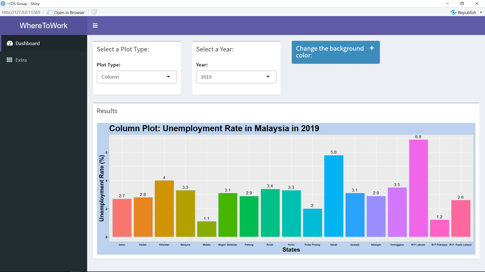
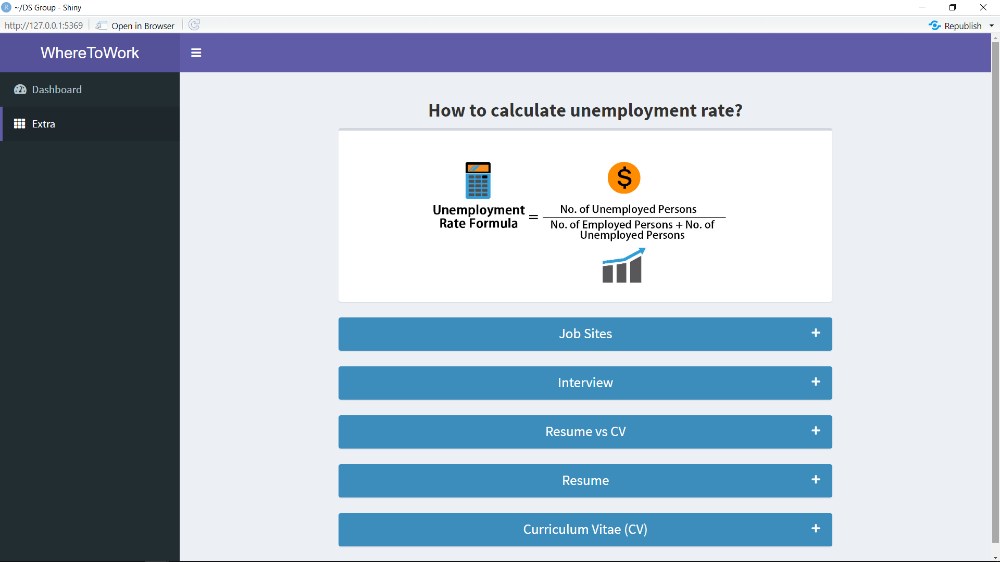

## Project Data

```{r results='hide',echo=FALSE}
    url = "https://www.data.gov.my/data/en_US/dataset/labour-force-statistics-malaysia-1092/resource/535d70a3-2697-4007-b013-93fd6d33659e"
```

The shiny app analysis open data is obtained from the **data.gov.my** web site.  

This data set shows unemployment rate by state in Malaysia for year 1982 until 2019. The statistics is derived from Labour Force Survey (LFS) which is conducted every month using household approach and refers to those between the working age of 15-64 years old.  

Source of the data set is: `r url`  

The user of the shiny app can look at each of these data subsets graphically. For each topic, two graphs are available:  

* Column  
* Dot Plot  

======================================================================================================


## How to use the app

    
The sidebar panel is where the tabs are located. In the Dashboard tab, interactive charts/plots are provided to display unemployment rate sorted by states and years. User can select a column plot or dot plot. Other than that, user can select a year and, as an option, user can select the background color of the result that suit their preference.
 

In the Extra tab, the formula of the unemployment rate and some job related stuff are provided. User can check out the job sites, interview tips, resume and Curriculum Vitae.    

## Presentation

The slide show presentation of this app can be viewed at <a href="https://rpubs.com/AmniWahit/GroupProject" target="_blank">https://rpubs.com/AmniWahit/GroupProject</a>. This was created using **R Presentation**.  

## Code Reproducability

The code that downloads the raw data, cleans it up and prepares it for this app forms part of the github repo at https://github.com/amniwahit/GroupProject.git.

This repo contains all the code and data making up this solution. The files and folders are the following:

1  **README.md** - Text file that lists the project question and points to this file.  
2  *Data Cleaning* - The source data used in this project.  
3  *Data Exploration* -  The code for doing exploratory data analysis and data visualization.  
4  *Presentation* - The R Markdown is used to create the RStudio Presenter presentation.  
5  *Data Product* - The code used for the Shiny app.  

 